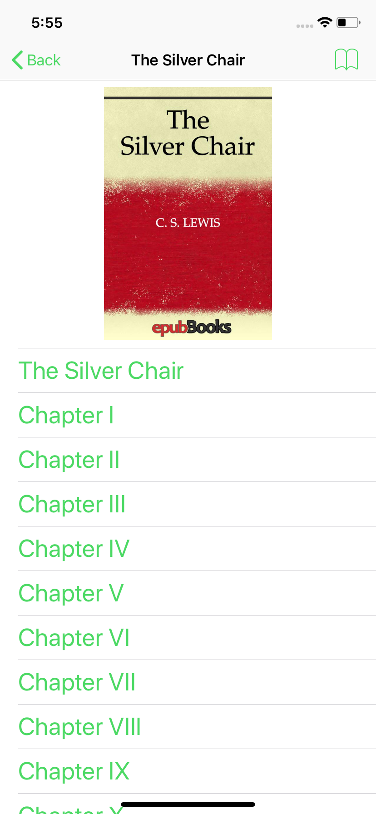
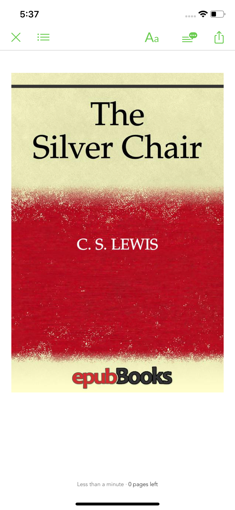

# IrvTestReader
簡單分析Epub的Demo

首先針對Epub格式進行了分析做了這個簡單的DE  
展現成果如下，首先取出了書本的基本資料，將其中Title放在navigation title上  
然後將TableView的第一欄放入封面圖片，之後把每一個章節放在其餘的欄位  
  

選取任何章節可以觀看內容，在這邊是直接透過webview瀏覽其內容做簡單的Demo  

之後也使用了網路上有名的Library做了簡單的閱讀器[FolioReader](https://github.com/FolioReader/FolioReaderKit)  

